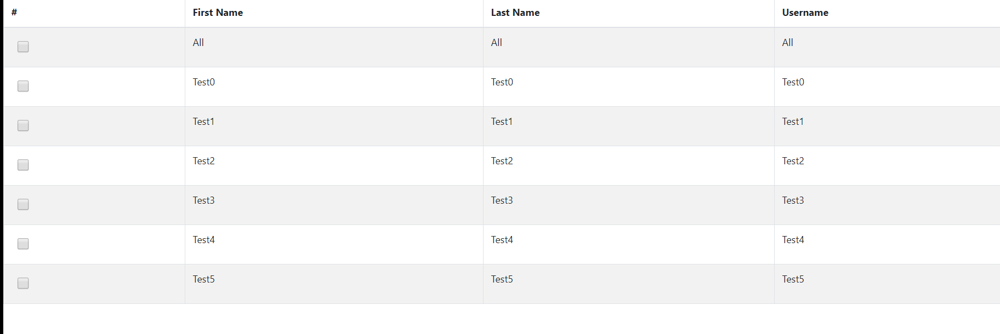

# react-checkbox-handling

A HOC to manage checkboxes state

## Demo

[](https://codesandbox.io/s/sharp-raman-pzp90?fontsize=14&hidenavigation=1&theme=dark)

## Installation

```sh
npm install react-checkbox-handling
```
## Usage

1 . Import handleCheckbox

```js
import  handleCheckbox  from 'react-checkbox-handling';
```

2 . Pass your component to handlechekbox

```js
export default handleCheckbox(ComponentName,Configuration(optional))
```

## Configuration Options

| Option                | Type                  | Default Value   | Description
| :-------------------- | :-------------------- | :------------   | :---------------------- |
| checkboxKey           | string                | 'CHECK_KEY'     | To provide custom key to check 
| isShiftRequired       | boolean               | false           | If shift key support is required or not

## Props Provided

| Prop Name                | Type                  | Default Value   | Description                         
| :----------------------- | :-------------------- | :------------   | :-----------------------------------|
| checkedItems             | Array                 | []              | Checked values                      
| checkAll                 | Function              | NA              | To check all the values             
| uncheckAll               | Function              | NA              | To uncheck all the values           
| updateCheckedItems       | Function              | NA              | To update the checked item array      
| updateTotalItems         | Function              | NA              | To update the total list of items


# Example

Copy the example folder in your project and run it.

## How it works



